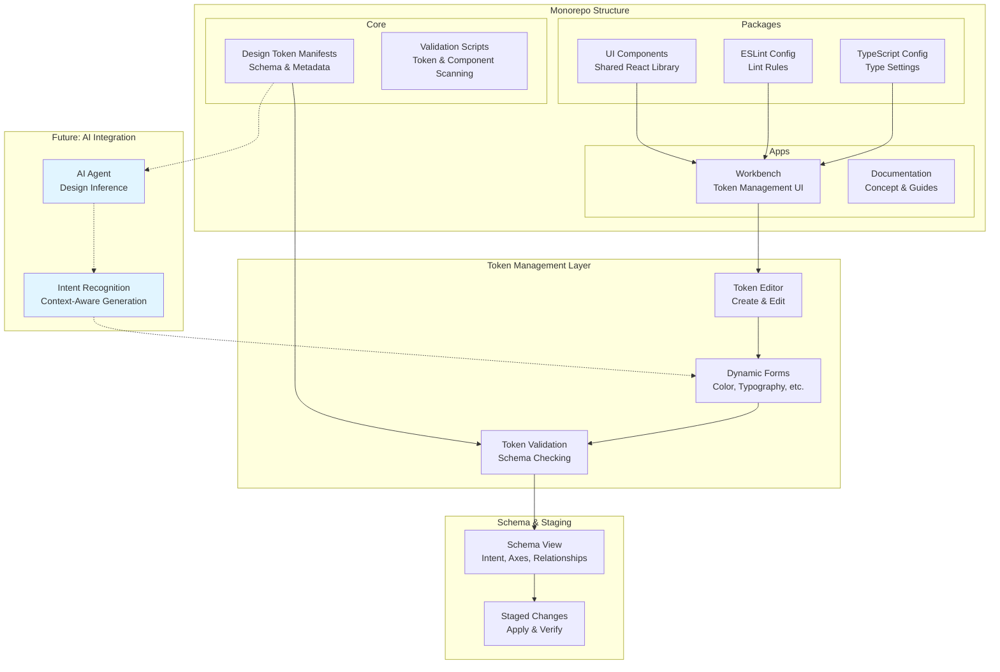

# Design System Oracle (DSO)

DSO (Design System Observer) is built on the paradigm of [Inference Design Systems](https://www.proofofconcept.pub/p/design-systems-are-now-inference). It focuses on turning traditional design tokens into a design language layer that AI agents can actually understand, combine, and act on. By capturing intent, roles, and relationships around tokens, DSO helps design systems move beyond static configuration and toward interfaces that respond intelligently to context.

This monorepo contains the complete DSO implementation, including the interactive workbench for token management, reusable UI components, and shared configuration tools. After terminal initialization is completed, the workbench becomes the main place to build, edit, model, and validate token systems.

## Getting Started

### Prerequisites

- Node.js 18+
- npm 10.9.4+

### Installation

Clone the repository and install dependencies:

```bash
git clone <repository-url>
cd dso-project
npm install
```

### Running Locally

Start all apps and watch for changes:

```bash
npm run dev
```

The workbench will be available at `http://localhost:3000`.

### Running Specific Commands

```bash
npm run build         # Build all apps and packages
npm run lint          # Lint all packages
npm run check-types   # Validate types across the project
npm run test          # Run tests
npm run scan          # Scan and validate tokens and components
```

## Tech Stack

- **Monorepo**: Turbo, npm Workspaces
- **Framework**: Next.js 16
- **Language**: TypeScript
- **UI Library**: React 19
- **Styling**: Tailwind CSS
- **Animation**: Framer Motion
- **Node Graph**: XYFlow
- **Testing**: Vitest with React Testing Library
- **Linting**: ESLint
- **Code Formatting**: Prettier

## Project Structure

```
dso-project/
├── apps/
│   ├── docs/              # Documentation site
│   ├── workbench/         # Interactive token management UI
│
├── packages/
│   ├── ui/                # Shared React components
│   ├── eslint-config/     # Shared ESLint configuration
│   ├── typescript-config/ # Shared TypeScript configuration
│
├── scripts/               # Token scanning and validation scripts
│
└── [manifests]            # design-tokens-manifest.json, etc.
```

## Contribution Guide

### Branch Naming

Use the following prefixes for branches:

- `feat/` — New features
- `test/` — Adding or updating tests
- `refactor/` — Code refactoring without behavior changes
- `chore/` — Maintenance tasks, dependency updates, documentation

Example: `feat/add-gradient-tokens`, `chore/update-dependencies`

### Pull Requests

- Create a PR with a clear title and description
- Link any related issues
- Ensure tests pass and types are correct
- One approval from maintainers(e.g. Copilot) before merge

### Commit Messages

Keep commits focused and descriptive:

- Use present tense: "Add feature" not "Added feature"
- Be specific: "Fix color token validation" not "Fix bug"
- Reference scope in parentheses: `feat(component-name):`

Example:

```
feat(token-form): add gradient token type support
```

## Architecture



## Next Steps

- Read [Concept Overview](./apps/docs/concept-overview.md) to understand DSO's core ideas
- Check [Procedural Guide](./apps/docs/procedural.md) for step-by-step workflows
- Visit the [Workbench README](./apps/workbench/README.md) for UI-specific details

---

**Status**: Early stage. Features and APIs may change.
