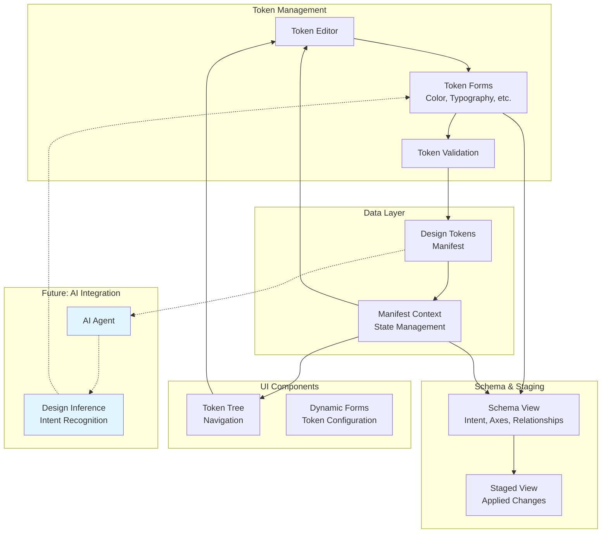

# Workbench

The interactive interface for designing and managing token systems in DSO. After terminal initialization is completed, this is the primary touchpoint for creating tokens, configuring explicit metadata, and defining schema-level relationships.

## Quick Start

After installing the monorepo (see [root README](../../README.md)), run the workbench from the project root:

```bash
npm run dev
```

The workbench will be available at `http://localhost:3000`.

To run only the workbench app:

```bash
cd apps/workbench
npm run dev
```

## Project Structure

```
app/
├── _shared/              # Shared context and shell components
│   ├── context/          # StagedManifestContext, WorkbenchShellContext
│   └── shell/            # Header, Navigation, WorkbenchShell layout
├── _config/              # Navigation and app configuration
├── api/                  # API routes (manifest endpoints)
├── schema/               # Schema View — define and inspect token schema and relationships
├── staged/               # Staged View — manage queued token changes
└── tokens/               # Tokens View — main token editor
    ├── components/       # TokenEditor, TokenForms, TokenTree nodes
    └── lib/              # Utilities and fixtures
```

## Main Features

### Tokens View

The core editing interface for your design tokens. Navigate the token tree, select tokens to edit, and see forms tailored to each token type (color, typography, spacing, etc).

**Key components:**

- `TokenTree` — Hierarchical navigation of tokens
- `TokenForms` — Dynamic forms for token properties
- `TokenTypeNode`, `TokenValueDetail` — Display and edit individual tokens

### Metadata-Backed Editing

The workbench is intended to support richer token records over time, not only raw values. The direction is to let each token carry metadata such as role, usage, constraints, and relations, backed by an explicit schema in TypeScript and validated with tools like JSON Schema, Zod, or TypeBox.

This would let the editor treat tokens as structured objects instead of isolated values. A token could show:

- semantic name
- role and usage
- constraint rules
- relations to other tokens
- axes such as theme, state, and density

That makes the workbench the place where token meaning is authored, not just token values.

### Schema View

Define and inspect token schema structures, including intent, axes, context, and relationships. This view focuses on system-level modeling rather than component-level visual preview.

### Staged View

Review and manage token changes before applying them to your manifest. Useful for testing multiple changes together.

## Future Direction

The workbench should eventually feed structured token data to downstream tooling. The intended shape is not just a token JSON file, but token JSON plus a relationship graph that captures inheritance, aliases, references, and usage rules.

That future path makes the workbench useful for both humans and agents:

- humans edit tokens through the UI
- the system validates the schema and metadata
- agents ingest the same structured token set for reasoning and generation

## Development

### Running Tests

```bash
npm run test          # Run tests once
npm run test:watch   # Watch mode
npm run test:ui      # UI mode with visual dashboard
```

### Type Checking

```bash
npm run check-types
```

### Linting

```bash
npm run lint
```

## Architecture



---

For detailed documentation on concepts and procedures, see:

- [Concept Overview](../docs/concept-overview.md)
- [Procedural Guide](../docs/procedural.md)
